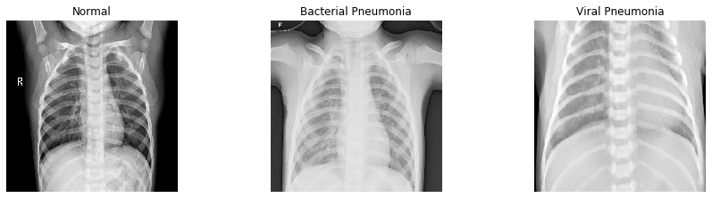
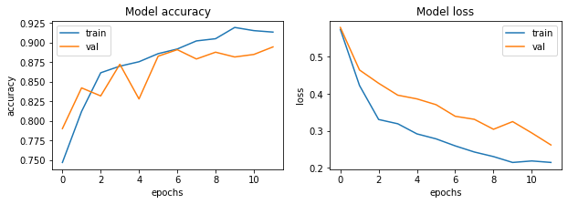

## Diagnosing Pneumonia with a Convolutional Neural Network

### Overview
Expert healthcare is a resource that is consistently in short supply.  As powers of computational pattern recognition increase with new technologies, so does the potential to increase access to this important resource.  The power of convolutional neural networks for image interpretation has reached a stage where performance superior to a human diagnostician is within reach.  Leveraging these emerging technologies for healthcare can free up healthcare professionals to focus on other tasks.  
  

### A Public Health Imperative

About 2.56 million people died of pneumonia in 2017.  This technology can be a first step in the direction of reducing that number.  Pneumonia is a potentially deadly inflamatory disease resulting from a bacterial or viral infection.  Accurate and timely diagnosis is critical to decreasing morbidity; furthermore, outsourcing such a task to a legion of machine slaves can reduce the burden to healthcare workers.   

### Our Data

The training data are over 5000 x-ray images from a hospital in China.  The subjects are all children between 1 and 5 years of age.  The data was then reviewed and classified independently by two physicians to insure accurate labeling of the training data.

### The Model and Results

The model was built in Keras.  It is convolutional neural network.  We iterated over three models but the most accurate one has three hidden layers.  The activation functions were Relu in the hidden layers and sigmoid at the output.  The model achieved approximately 90% accuracy on the test data.  

### Conclusions

This peformance represents a first step in deep learning diagnostics.  In a clincal setting this level of accuracy would be unnacceptable, and much improvement is required before deployment; however, these results do suggest that clinical level accuracy is possible.  

### The Future

The potential applications of this technology are only limited by quantity and quality of data.  Any disease that can be diagnosed by digitizable imaging is potentially vulnerable to deep learning.  Some next steps for this dataset would be to:
-  **More categories of classification.** develop the model to distinguish between bacterial and viral pneumonia.  
-  **More diverse data.** A larger dataset that includes all age ranges and potentially confounding health conditions would be important for extending the model to more patients.  This data is collected on child subjects, who would be assumed to be without the many long term effects of the respiratory conditions that may complicate diagnosis.  
- **Data on other diseases.** Large datasets of x-rays of other diseases like cancer would be useful for widening the diagnositic scope of these applications.  

### Contacts
For more information see the [repository](https://github.com/AMiNo-13/Pneumonia-Detection-Using-CNN) or contact:  

Amin Nazerzadeh at:
am.nazerz@gmail.com  

Eon Slemp at:
eonslemp@gmail.com
